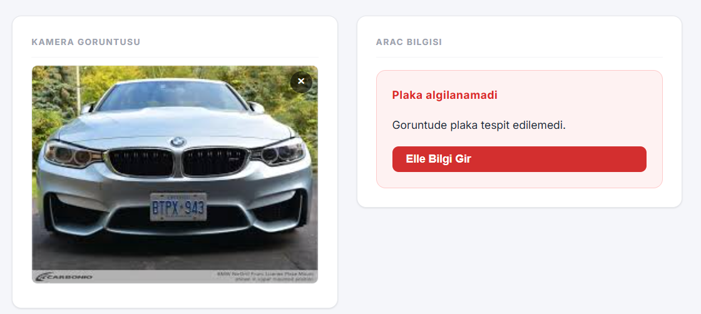
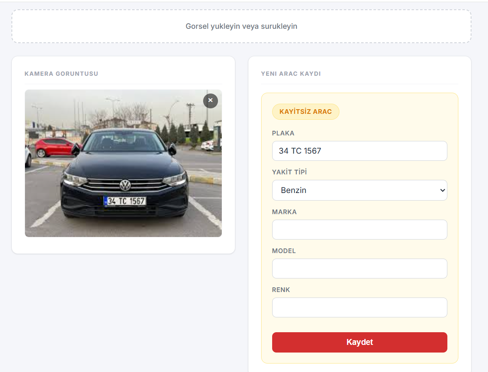
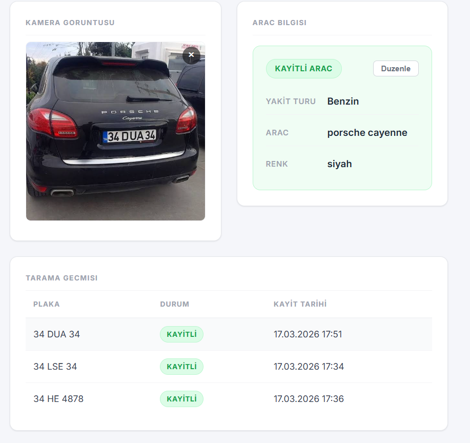

# Plate Recognition System

Turkish license plate detection and recognition system powered by a custom-trained YOLOv26n model and LLM-based OCR. Upload a vehicle image, the system detects the plate region with YOLO, reads the text via a vision LLM, and matches it against a vehicle database.

## Screenshots

| Plate Not Detected (Manual Entry) | New Vehicle Registration | Known Vehicle |
|---|---|---|
|  |  |  |

## Architecture

```
┌─────────────┐     ┌──────────────┐     ┌──────────────┐     ┌─────────┐     ┌────────┐
│   Frontend   │────▶│   Backend    │────▶│ YOLO Service │     │ LiteLLM │────▶│ Ollama │
│  React+Nginx │◀────│   FastAPI    │────▶│  Detection   │     │  Proxy  │     │  LLM   │
└─────────────┘     │              │     └──────────────┘     └─────────┘     └────────┘
                    │              │────▶┌──────────────┐────▶      │
                    │              │     │ OCR Service  │───────────┘
                    │              │     │  Recognition │
                    └──────┬───────┘     └──────────────┘
                           │
                    ┌──────▼───────┐
                    │  PostgreSQL  │
                    │   Database   │
                    └──────────────┘
```

### Services

| Service | Tech | Port | Description |
|---------|------|------|-------------|
| **Frontend** | React + Vite + Nginx | 3001 | Upload UI, vehicle info cards, scan history |
| **Backend** | FastAPI + SQLAlchemy | 8000 | REST API, business logic, database operations |
| **YOLO Service** | FastAPI + Ultralytics | 8001 | License plate detection with custom YOLOv26n model |
| **OCR Service** | FastAPI + httpx | 8002 | Plate text recognition via vision LLM |
| **LiteLLM** | LiteLLM Proxy | 4000 | AI gateway proxying requests to Ollama |
| **PostgreSQL** | PostgreSQL 16 | 5432 | Vehicle and recognition log storage |
| **LiteLLM DB** | PostgreSQL 16 | 5433 | LiteLLM internal storage |

### Recognition Pipeline

```
Image Upload → YOLO Detection → Crop Best Plate → OCR (Vision LLM) → DB Lookup → Response
```

1. User uploads a vehicle image
2. **YOLO Service** detects plate regions and returns cropped plate images with confidence scores
3. **OCR Service** sends the cropped plate to a vision LLM via LiteLLM, sanitizes the output, and validates against Turkish plate format
4. **Backend** normalizes the plate text, looks up the vehicle database, logs the recognition, and returns the result
5. If the vehicle is not registered, the user can register it with fuel type, brand, model, and color
6. If detection fails, the user can manually enter vehicle information

## YOLO Model Training

The plate detection model was trained using a Turkish license plate dataset:

- **Base Model**: YOLOv26n
- **Dataset**: [Turkish License Plate Dataset](https://www.kaggle.com/datasets/smaildurcan/turkish-license-plate-dataset) from Kaggle
- **Split**: Train / Validation (80/20)
- **Epochs**: 150 (with early stopping, patience=30)
- **Image Size**: 640x640
- **Augmentation**: HSV, translate, scale, horizontal flip, mosaic
- **Platform**: Google Colab (GPU)
- **Output**: `best.pt` — best performing weights used in production

The training script is available at [`train_yolo.py`](train_yolo.py).

## Tech Stack

**Backend**: Python 3.11, FastAPI, SQLAlchemy, Pydantic, httpx
**Frontend**: React 18, Vite, Nginx
**AI/ML**: YOLOv26n (Ultralytics), LiteLLM, Ollama
**Database**: PostgreSQL 16
**Infrastructure**: Docker, Docker Compose

## Getting Started

### Prerequisites

- Docker & Docker Compose
- [Ollama](https://ollama.ai) running on the host with a vision model (e.g., `glm-ocr`)
- Trained YOLO model (`best.pt`) placed in `yolo-service/models/`

### Setup

1. Clone the repository:
   ```bash
   git clone https://github.com/<your-username>/plate-recognition-system.git
   cd plate-recognition-system
   ```

2. Create `.env` from the example:
   ```bash
   cp .env.example .env
   ```

3. Edit `.env` and set your `LITELLM_MASTER_KEY` and other values as needed.

4. Place your trained YOLO model:
   ```bash
   cp /path/to/best.pt yolo-service/models/best.pt
   ```

5. Make sure Ollama is running with your vision model:
   ```bash
   ollama run glm-ocr
   ```

6. Start all services:
   ```bash
   docker compose up -d --build
   ```

7. Open http://localhost:3001 in your browser.

### Environment Variables

See [`.env.example`](.env.example) for all available configuration options including:
- Database credentials
- LiteLLM API key and model settings
- YOLO confidence threshold
- OCR confidence thresholds
- Service timeouts

## API Endpoints

| Method | Endpoint | Description |
|--------|----------|-------------|
| `POST` | `/api/recognize` | Upload image for plate recognition |
| `GET` | `/api/vehicles` | List registered vehicles (paginated) |
| `POST` | `/api/vehicles` | Register a new vehicle |
| `PUT` | `/api/vehicles/{id}` | Update vehicle information |
| `GET` | `/api/logs` | List recognition logs (paginated) |
| `PATCH` | `/api/logs/{id}/confirm` | Confirm/correct a detected plate |
| `GET` | `/health` | Service health check |

## Running Tests

```bash
# Backend tests
cd backend && pip install -r requirements.txt && python -m pytest tests/ -v

# OCR service tests
cd ocr-service && pip install -r requirements.txt && python -m pytest tests/ -v

# YOLO service tests
cd yolo-service && pip install -r requirements.txt && python -m pytest tests/ -v
```

## Project Structure

```
plate-recognition-system/
├── backend/                  # Main API service
│   ├── app/
│   │   ├── routes/           # API endpoints (recognize, vehicles, logs, feed)
│   │   ├── config.py         # Centralized configuration
│   │   ├── database.py       # Database connection pool
│   │   ├── models.py         # SQLAlchemy models (Vehicle, RecognitionLog)
│   │   ├── schemas.py        # Pydantic request/response schemas
│   │   ├── services.py       # Business logic (recognition pipeline)
│   │   └── plate_utils.py    # Plate normalization and validation
│   └── tests/
├── frontend/                 # React UI
│   ├── src/
│   │   ├── components/       # UI components
│   │   ├── styles/           # CSS styles
│   │   ├── api.js            # API client
│   │   └── App.jsx           # Main application
│   └── nginx.conf            # Nginx reverse proxy config
├── yolo-service/             # Plate detection microservice
│   ├── app/
│   │   ├── detector.py       # YOLO inference
│   │   └── config.py         # Detection settings
│   └── tests/
├── ocr-service/              # Plate OCR microservice
│   ├── app/
│   │   ├── recognizer.py     # LLM-based plate reading + sanitization
│   │   └── config.py         # OCR settings and confidence thresholds
│   └── tests/
├── training/                 # YOLO training notebook
├── train_yolo.py             # YOLO training script (Google Colab)
├── docker-compose.yml        # Multi-service orchestration
├── litellm_config.yaml       # LiteLLM proxy configuration
└── .env.example              # Environment variable template
```

## Roadmap

This project is actively being developed. Planned improvements:

- **Dataset Augmentation**: The current model struggles with plates positioned on the far right or left of the frame. Data augmentation techniques (rotation, shifting, perspective transforms) will be applied to improve detection accuracy in edge cases.
- **Training Improvements**: More epochs, hyperparameter tuning, and additional Turkish plate datasets to improve model robustness.
- **International Plate Support**: Extend the system to recognize plates from other countries (EU, US, etc.) as a next major milestone.
- **Live Camera Feed**: Real-time plate recognition from IP cameras or webcam streams.

## License

MIT
